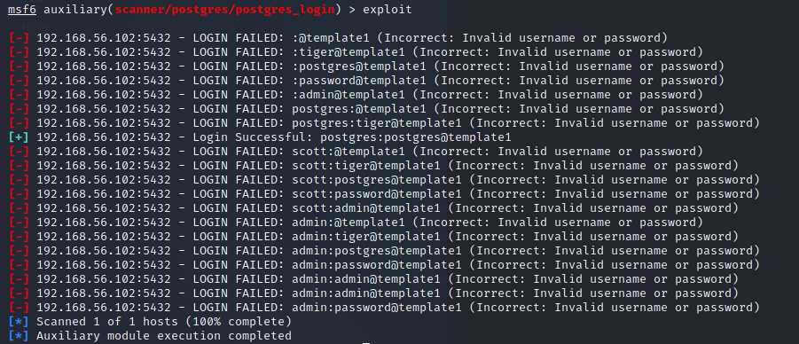
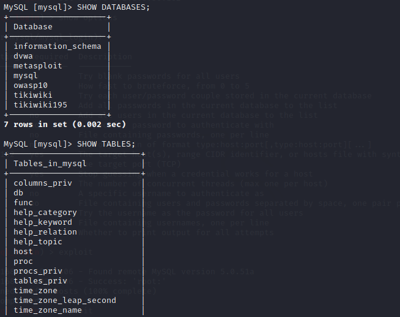
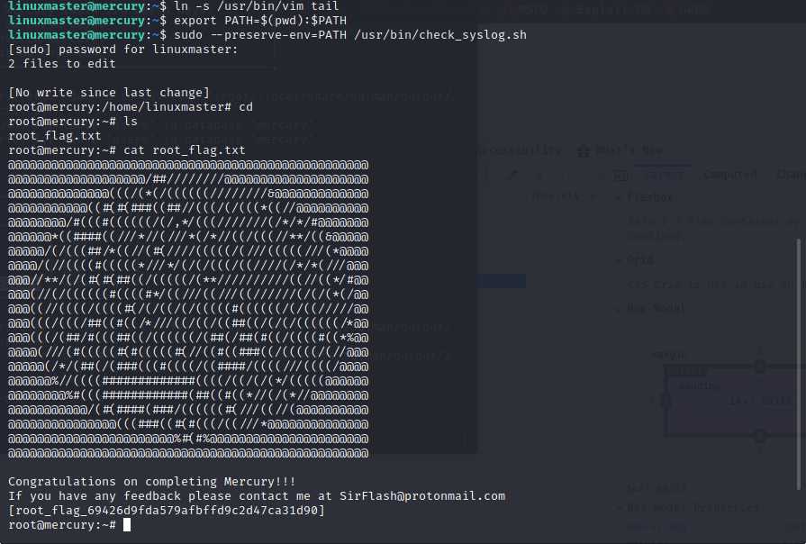

# H2
Viikon kaksi tehtävät.

## Lue artikkelit ja katso videot, tee kustakin muistiinpanot
Päivitys 13.04.2021 17.24
Tämä kohta unohtui tehdä päivetään tämän ja seuraavan päivän kuluessa

## Listaa työkaluja ja tekniikoita, jotka sopivat kuhunkin kybertappoketjun vaiheeseen
### Reconnaissance
- Tässä voisi esimerkiksi koittaa saada LinkedIn yhteyksiä kohde yritykseen --> Katso mitä taitoja työpaikan henkilökunnalla on merkattu
Linkedinissä ja mieti mitä korkattavia laitteita yrityksellä voisi olla
- Tässä vaiheessa voisi myös käyttää nmappia porttiskannaukseen ja tutkia jo etukäteen mitä portteja heillä on auki.

### Weponiztion
- Tässä vaiheessa etsi esimerkiksi ExploitDB:stä joku backdoori kohteen mahdollisesti käyttämään laitteeseen
- Tutki metasploitissa auki olevissa porteissa pyörivien softien backdooreja.

### Delivery
- Tässä voisi esimerkiksi koittaa viedä itse henklökohtaisesti USB tikun(jossa on vaikka joku ohjelma joka antaa etäyhteyden
tai asentaa keyloggerin, joka lähettää dataa takaisin sinulle) kohde yrityksen jonkun henkilön postilokeroon, esim jonkun adminin
lokeroon tai jonkun henkilön joka ei tee tietoteknisiä asioita.
- Toinen voisi olla, että lähettää sähköpostin asiakkaalle, jossa liitteenä joku tiedosto joka asiakkaan pitää ladata mutta tämä tiedosto
asentaakin vaikka keyloggerin.

### Exlpoitation
- Tämä vaihe voisi olla vaikka jonkun metasploitista löytyneen tai exploitDB:stä löytyneen exploitin hyödyntäminen

### Installation
- Tämä vaihe tapahtuu puoli automaattisesti, jos on saanut jotain jo asennettua etukäteen lähetetyltä USB tikulta. Jos on saanut
esim keyloggerilla salasanan ja käyttäjätunnuksen voi silloin kirjautua ssh:lla kohteen koneelle ja ladata sinne jotain tai sftp:llä
siirtää sinne jonkin haittaohjelman.

### Command and Control
- ssh:lla voi vaikka ajaa komentoja kohteen koneella ja seurata uusia tiedostoja.

### Actions on Objectives
- Lopuksi voisi vaikka vielä sftp:llä hakea tiedostoja kohde koneelta.

## Metasploit ja metasplotable2
- Lataa metasplotable2 sourceforgesta ja luo sille virtuaalikone.
- Liitä metasplotable2 virtuaalikone ja kali linux samaan host-only verkkoon.
- Käynnistä metasplotable2 ja tarkista ip osoite.
- Laita postgresql käyntiin kali linuxsissa
- käynnistä metsploit `msfconsole`
### Tunnilla käyty tunketumis tapa, vsftpd
- aja komento `msfdb init` niin saat postgresql käyttöön metasploitissa
- varmista komennolla `db_status`, että tietokanta on käytössä
- luo uusi workspace: `workspace -a nimi` nimi kohdalle workspacen nimi 
- kun kokeilet ensin komentoa `services` ei tule mitään
- aja komento `db_nmap -p 80, 443 ip.osoite/24 -oA http2` (iposoite kohtaan metasplotable2 koneesi iposoite), näin saat samalla tallenettua
nmapin skannauksen tiedostoon.
- aja `services` uudestaan ja näät kaikki kohteessa olevat käynnissä olevat palvelut, niiden portit ja protokollat. Nämä näkyvät myös nmapin
tuolsteessa mutta ne on tallennettu myös.
- `db_nmap -sV iposoite -oA 3top100sv` komennolla saat nmapilla myös versiot, jotka ovat käytössä.
- `search vsftpd` komennolla löydät mitä exploitteja vsftpd:lle on.
- `info 0`, saa exploitin tiedot
- `use 0` aloittaa exploitin käytön
- `show payloads` Näyttää käytössä olevan exploitin payloadit
- `show options` Näyttää käytössä olevan exploitin mahdolliset/tarpeelliset moduulit
- `set RHOSTS ip`(ip:n kohdalle sinun ip) asettaa RHOST parmetrin exploitille. RHOST on siis kohteen osoite
- `show options` Nyt näät tällä komennolla, että RHOSTS on asetettu
- `exploit` komennolla pääset root käyttäjänä koneelle ja voit käyttää konetta
- `sessions`, `sessions -h`, sessions -u 1, sessions 1 tässä kohdassa koitin eri sessions komentoja, jotta saisin toisen shellin käyttöön
kohde koneella mutta en saanut toimimaan
- `exit` exit komennolla pääset pois

### Toinen tapa tunkeutua, PostgreSQL
- Ensin ajoin komennon `nmap 192.168.56.0/24`, jotta saan esille metasplotable2 koneen ip:n
- Tämän jälkeen katsoin `nmap 192.168.56.102 -sV` komennolla katsoin avoimissa porteissa pyörivien ohjelmistojen versiot.
- PostgreSQL oli versiossa 8.3. Tämän tarkistamisen jälkeen komennolla `search postgresql` katsoin mitä aukkoja postgressa on.
- Yksi aukoista oli postgres_login:ssa joka vaikutti siltä, että siihen jonkun hyökkäyksen kohdistamalla voisi saada rootit tai 
jonkun toisen kirjautumisen.
- metasploitin info komennolla näin, että tuon aukon käyttämiseen riittää, että tietää kohteen ip:n. Muut kohdat metasploit on
asettanut itse.
- käyttämllä postgres_login aukkoa nähtiin, että löytyi yksi käyttäjänimi ja salasana pari: postgres ja postgres

- Näillä tunnuksilla sai ssh yhteydellä kirjauduttua postgres käyttäjälle
- Postgres käyttäjällä pääsi myös root kansioon mutta root käyttäjälle en päässyt.

### Kolmas tunkeutumis tapa, MySQL
- Kun jo tiesin koneen ip:n en enään uudelleen ajanut komentoa, jolla se selviäisi. Aloitin metasploitissa komennolla `search mysql`,
jotta löydän aukkoja. MySQL:stä löytyi mysql_login exploitti joten kokeilin sitä. Asetin RHOSTS:in moduulille ja käytin `exploit`
komentoa. Seuraavanlainen tuloste tuli:

Jouduin tukeutumaan verkkoon tässä vaiheessa, mutta pienen etsinnän jälkeen löysin, että `Success: 'root:'` tarkoittaa, että mysql:n
ei ole salasanaa. Seuraavaksi etsin, että miten mysql kantaan kirjaudutaan, etäyhteydellä.
- Seuraavaksi siis ajoin komennon `mysql -u root -h 192.168.56.102` ja pääsin kirjautumaan mysql tietokantaan ja ajamaan komentoja.
- Enempää en saanut kannasta irti, koska kaikkien käyttäjien salasanat olivat tyhjiä.

## Asenna jokin kone VulnHubista ja tunkeudu siihen.
- Asensin koneen nimeltä Mercury (https://www.vulnhub.com/entry/the-planets-mercury,544)
- Aloitin ajamlla komennon `nmap 192.168.56.0/24`, jotta löytäisin koneen ip osoitteen. IP löytyi tämän komennon avulla.
- seuraavaksi etsin nmapilla avoimet portit ja löysin portit 22/ssh ja 8080/tcp
- Tässä vaiheessa tuli pieni ongelma, koska en keksinyt miten edetä joten jouduin etsimään verkosta miten edetä ja löysin ohjeen
täältä: (https://www.hackingarticles.in/mercury-vulnhub-walkthrough/)
- Seuraava vaihe oli ajaa `dirb` komento http sivulle. Tämän komennon avulla löytyi robots.txt tiedosto.
- Tiedostosta ei löytynyt muuta kuin 2 riviä: User-agent: * ja Disallow: / , jos laittaa toisen, vaikka * urliin saa 404 sivun joka
paljastaa uuden siuvn /mercuryfacts
- /mercuryfacts sivun takaa löytyi kaksi linkkiä. /todo linkin takaa löyty lista jossa luki mitä vielä tehdä ja kahden kohdalla huomio
kiinnittyi erityisesti. Kohdat "Implementing authentication" ja "Use model in djnago instead of direct mysql call" kertoivat, että
tietokannassa ei ole autentikaatiota ja se on todennäköisesti avoin SQL injektiolle.
- Ajemmin hyödyntämästäni linkistä löysin, että he olivat käyttäneet `sqlmap -u` komentoa `--dbs`ja `--batch` optioneilla
(`sqlmap -u 192.168.56.104 --dbs --batch`).
Komento paljasti, että tietokannasta löytyy kaksi tietokantaa: information_schema ja mercury. Koska tehtävän nimi oli mercury
ajattelin, että sitä on seuraavaksi hyvä tutkia.
- Seuraavaksi tutkin, että miten sqlmapilla voi koittaa saada tietokannoista dataa ja ja löysin, että komentoon piti lisätä -D ja 
tietokannan nimi ja vaihtaa `--dbs` option `--dump-all` optioniksi
- Tällä komennolla sain kaikki tietokannan tiedot ulos. Yhdessä taulussa oli kaikki käyttäjät ja käyttäjä nimi webmaster vaikutti siltä,
että hänen tiedostoistaan voisi löytyä jotain.
- Koska koneessa oli myös ssh auki, koitin ottaa ssh yhteyden koneeseen webmasterina ja se onnistui. Webmasterin tiedostoissa oli
tiedosto: user_flag.txt, josta löytyi ensimmäinen lippu.
- Tämän jälkeen siirryin ainoaan käyttäjän tekemään kansioon mercury_proj. Siellä oli notes.txt tiedosto jossa oli base64 enkoodattu
salasanat webmaster ja linuxmaster käyttäjille. Komennolla `echo enkoodattu_salasana | base64 -d` sain linuxmaster käyttäjän salasanan.
- Salasanan saatuani vaihdoin käyttäjän linuxmasteriksi komennolla `su linuxmaster`
- Koska kotihakemistosta ei ja root hakemistosta en löytänyt mitään käännyin taas ohjeiden puoleen ja siellä kerrottiin, että katsotaan
kenellä on sudo oikeudet komennolla `sudo -l`. Tulosteesta selvisim, että linuxmaster voi ajaa `check_syslog.sh` skriptin.
- Komennolla `head -n 5 /usr/bin/check_syslog.sh` näin mitä skriptin oli tarkoitus tehdä ja sillä pystyi listaamaan 10 viimeistä
syslogiin laitettua logattavaa tietoa.
- Seuraavaksi ohjeissa kerrottiin, että pitää luoda symlink vim:lle ja tail komennolle symlink ja muokata environment muuttujaa. Eli 
ensin komento `ln -s /usr/bin/vim tail` ja sitten komento `export PATH=$(pwd):$PATH`
- Näiden komentojen jälkeen piti ajaa syslog skripti preserve environmentissa: `sudo --preserve-env=PATH /usr/bin/check_syslog.sh`.
Tällöin saa käynnistettyä tyhjän tiedoston vim:ssä. Kun vim:ssä ajaa komennon (eli painaa : normal modessa) `!/bin/bash` saa root
käyttäjän koneelle ja löytää root flagin.

## Vapaaehtoinen: Asenna ja korkkaa Metasploitable 3
- Metasploitable 3 asensin [Teron ohjeiden mukaan](https://terokarvinen.com/2018/install-metasploitable-3-vulnerable-target-computer/)
- Seuraavaksi kävin vaihtamssa NAT verkon Host-Only verkkoon
- Ajoin Kalissa ensin komennon `nmap 192.168.56.0/24`, jotta saan metasploitable3 ip:n. Sen jälkeen avasin msfconsolen ja ajoin komennon
`db_nmap 192.168.56.106 -sV`, jotta saan koneella olevat avonaiset portit ja niissä pyörivien ohjelmien versiot.
- Ajoin näiden jälkeen kommennon `search proftpd`, jos löytäisin ftp aukon. Sieltä löytyi aukko, jonka nimessä oli Mod_Copy Command Execution,
joka vaikutti mahdolliselta toimivalta aukolta. Komennolla `info 5` selvisi, että vaatii vain kohteen ip:n, joten ajoin ensin komennon `use 5`
ja sitten asetin kohteeksi meta3 koneen ip:n. Kun komento ei toiminut huomasin, että joudun asettamaan myös payloadain mutta mistään niistä
ei tullut muuta vastausta kuin, että Exploit completed, but no session was created.
- Seuraavaksi siis koitin toista porttia. Tässä vaiheessa jouduin käyttämään apuna verkkoa. Koska koneessa on käynnissä Drupal weppi sovellus,
jossa on remote code execution aukko, koitin hakkeroituia sinne(https://stuffwithaurum.com/2020/04/17/metasploitable-3-linux-an-exploitation-guide/).
- Ensin otin käyttöön drupal_drupageddon moduulin. Sitten asetin kohteen ip:n RHOSTS kohtaan. Tässä kohdassa tuli taas hetki kun en ollut varma
mitä tehdä, joten koitin seuraavaksi näiden ohjeiden mukaan https://www.thomaslaurenson.com/blog/2018-07-09/metasploitable3-pentesting-the-ubuntu-linux-version-part2/
mutta niistäkään ei ollut apua ja aika tehtävien tekemiseen oli niin lopussa, että päätin jättää tämän myöhemmäksi pähkäiltäväksi.

## Tehtävä lähteet
Tehtävät ovat täältä: https://terokarvinen.com/2021/hakkerointi-kurssi-tunkeutumistestaus-ict4tn027-3005/
