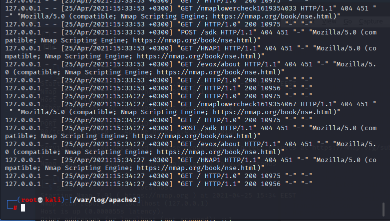
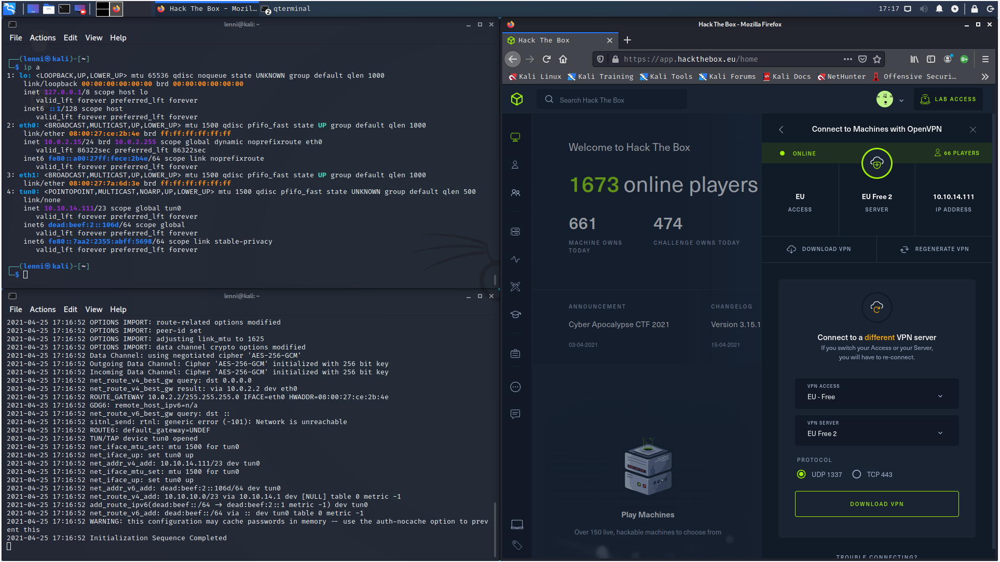
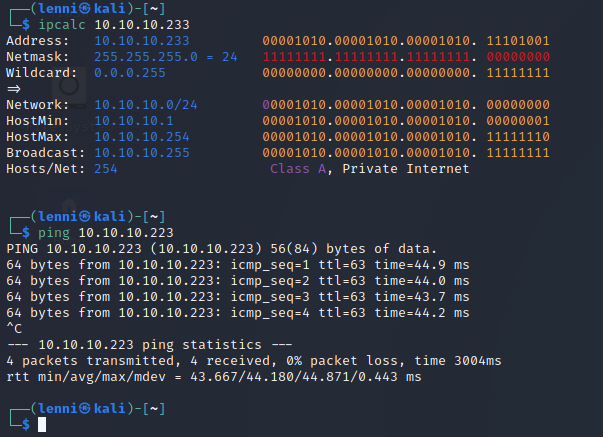
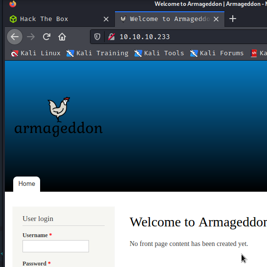

# H4

## Lue artikkelit ja katso videot, tee kustakin muistiinpanot

Lähde: [Santos et al Oreilly](https://learning.oreilly.com/videos/the-art-of/9780135767849/9780135767849-SPTT_04_00)

- Aktiivisessa tiedustelussa lähetetään paketteja kohteeseen, esim. porttiskannaus
- Tiedustelun päätteeksi pitäisi olla todella hyvä kuva kohteesta kuten mitä mahdollisia hyökkäyksen kohteita sieltä löytyy
- Työkaluja:
### Porttiskannaukseen 
        - nmap
        - Masscan, nopea porttiskanneri, ei yhtä kattava kuin nmap
        - Udpprotoscanner, udp porttien skannamiseen
### Web Service Review 
        - EyeWitness, saa raportin jossa on kuvankaappauksia ja header infoa kohteista jossa on nettisivu

- Vulnerability Scanning työkaluja:
### Network
        - OpenVAS - FOSS
        - Nmap (rajoitettu)

### Web
        - Nikto
        - WPScan, wordpress sivuille
        - SQLMap, SQLi:lle hyvä
        - Burp Suite
        - Zed Attack Proxy

Lähde: [Nmap network Scanning](https://nmap.org/book/nmap-overview-and-demos.html)

- `nmap -sL` on hyvä jos haluaa pysyä piilossa ja saada tietoa hostien nimistä
- `-p-` vivulla sanotaan nmapille että skannaa kaikki portit 1-65535
- `-PE -PP -PS80,443 -PA3389 -PU40125` ovat kaikki ping tyypin vipuja
- `-A` vivulla otetaan agressiivinen moodi käyttöön

Lähde: [Nmap Reference Guide, Port Scanning Basics](https://nmap.org/book/man-port-scanning-basics.html)

Nmapissa on skannauksen jälkeen porteille 6 eri statusta:
- open: Tarkoittaa sitä, että softa hyväksyy TCP yhteyksiä, UDP Datagrammeja ja SCTP yhdistyksiä kysessä olevaan porttiin
- closed: Tarkoittaa sitä, että porttiin on pääsy mutta portissa ei ole softaa kuuntelemassa sitä
- filtered: Tarkoittaa sitä, että nmap ei osaa sanoa onko portti auki vai ei, tällaisia portteja nmap yrittää useamman kerran, koska se ei ole
varma oliko hetken aikaa huono verkkoyheteys vai tiputiko portti kaikki probet
- unfiltered: Tarkoittaa sitä, että portti on saatavilla mutta nmap ei osaa sanoa onko portti auki vai kiinni
- open|filtered: Tarkoittaa sitä, että nmap ei pysty määrittelemään onko portti open vai filtered tilassa. Tämä tapahtuu usein kun avoin portti
ei vastaa mitään
- closed|filtered: Tarokittaa sitä, että nmap ei pysty määrittelemään onko portti closed vai filtered tilassa.

Lähde: [Nmap Reference Guide, Port Scanning Techniques]

- -sS (TCP SYN scan): nmapin default skanni ja yleisin portti skannaus. Tämä skannaus on ns. puoli aukinainen skannaus eli se lähettää SYN paketin
mutta ei ACK paketin vastaanottamisen jälkeen enään vastaa. Ei ole siis myöskään tunkeileva skannaus.
- -sT (TCP connect scan): nmap käyttää tätä defaulttin kun SYN skannaus ei ole vaihtoehto. Tapahtuu yleensä kun ei ole raaka paketteihin
oikeuksia. Tämä skannaus tapa päätyy yleensä myös kohteen lokeihin, koska se vaatii esim. enemmän paketteja saadakseen saman infon.
- -sU (UDP scans): Tämä skannaus eroaa kahdesta edellisestä eniten sillä, että tässä skannataan UDP palveluiden portteja. Tähän voi myös yhdistää
-sS skannauksen jos haluaa käydä molempien, TCP ja UDP, protokollien portit läpi.

## Miten nmap toimii?

### TCP connect scan -sT
- `-sT` vipu skannissa on paljon tietoja paketissa lähde koneesta vaikka kohde portti olisikin kiinni. Kun portti on auki nmap läpi koko
three way handshaken eli lähettää SYN paketin, ottaa vastaan SYN/ACK paketin ja vastaa vilä ACK paketilla. Lopuksi se lähettää vielä 
RST (eli reset) ja ACK paketit. Sieltä löytyy mm. mistä IP osoitteesta skanni on lähetetty, mitä IP versiota on käytetty, 
headerin koko tavuina, lähde portti ja TCP ikkunan koko. Tässä myös SACK_PERM=1 eli toistensa kanssa keskustelevat laitteet voivat valikodusti käyttää tavuja.
Pakettia voi myös tarkastella hexa decimaaleina mutta sitä on ihmisenä hieman hankalampi lukea :).

### TCP SYN scan -sS
- `-sS` vipu skannissa on myös jonkin verran tietoa lähde koneesta. Erona `-sT` vipuun nmap lähettää SYN/ACK paketin jälkeen RST paketin kohteelle. Toki wiresharkista löytyy
edelleen lähde koneen ip-osoite. Tässä taas ei ole valikoivaa tavujen käyttöä laitteiden välillä.

### ping sweep -sn
- `-sn` vipu ei skannaa portteja vaan skannaa vain määritellyllä välillä ip-osoitteet ja katsoo mitkä niistä ovat auki. Esim. komento `nmap -sn 192.168.56.1-255` skannaa kaikki
ip oisoitteet väliltä 192.168.56.1 - 192.168.56.255. Tämä skannaus on todella kevyt ja nopea sekä se käyttää ARP protokollaa. Tällä saa siis esiin ip-osoitteiden MAC-osoitteet.
Lähettjän oma IP-osoite on toki näkyvissä wiresharkissa.

### dont't ping -Pn
- `-Pn` vipu skannaa ip-osoitteessa olevat portit mutta ei tarkista onko laitteet päällä vai ei. Tämä ei siis "Pingaa osoitteita" tai odota niiltä vastausta. Wiresharkillä myös
tämä skanni näyttää ip-osoitteen mutta esim. TCP ikkunan koko on huomattavasti pienempi kuin `-sT` vivun skannissa.

### version detection -sV
- Laitoin tässä python http serverin pystyyn kalin localhostiin ja ajoin nmapin sinne porttiin 80 (`nmap -sV -p 80 0.0.0.0`).  Wiresharkkiin tuli tässä todella paljon dataa
vaikka skannasinkin vain yhden portin ja oli paketeissa oli paljon tietoja lähde osoitteesta. Kun nmap sai suoritettua loppuun ymmärsin miksi wiresharkissa tuli niin paljon 
dataa. Nmap ei vain tunnistanut python3:n http.serviceä täysin: ![./img/pyServerOutput.png]

## Nmap:n toimintoja

### Porttien valinta -p1-100, --top-ports 5
- Vivulla `-p1-100` kerrotaa nmapille, että skannaa portit 1-100. `-p` vipua voisi käyttää silloin kun haluaa nopeasti skannata vain tietyn tai
tietyt portit. Voi myös käyttää vaikka 22-443 väliä. `--top-ports 5` vivulla taas kerrotaan nmapille, että skannaa viisi yleisintä porttia. 
`--top-ports` vipua käytetään kun halutaan skannata vain teitty määrä suosituimpia portteja.

### ip-osoitteiden valinta, verkkomaskilla 10.10.10.0/24, alku- ja loppuosoitteella 10.10.10.100-130
- Skannaamalle verkkomaskilla `nmap 10.10.10.0/24` nmap käy läpi kaikki osoittet välillä 10.10.10.1-254. Tämä on hyödyllinen kun haluaa nähdä
kuinka paljon laitteita tietyssä verkossa on kiinni. `nmap 10.10.10.100-130` komennolla taas käydään osoittett vain väliltä 100-130. Alku- ja
loppuosoitteen määriitäminen on silloin hyödyllistä jos on vaikka annettu luvat portti skannata vain tietyllä välillä olevat osoitteet.

### output files -oA foo
- `-oA` vivulla tallennetaan nmapin tuloste tiedostoon ja se tallentaa ne kolmella eri päätteellä: nmap, gnmap ja xml. Pääte nmap on sama mitä tulosteessa oli, gnmap päätteellä
oleva tiedosto on "greppable nmap" eli helpommin käytettävissä grep komennon kanssa ja xml päätteellä oleva tiedosto on tulosteesta xml formaattiin tallennettu versio. Tämä on 
todella hyödyllinen vipu, koska tunkeutumis testausta tehdessä ei haluta herättää huomiota joten on kannattavaa tallentaa ensimmäisissä skanneissa saadut tiedot tiedostoon.

### OS fingerprinting, version detection, script, tracroute -A
- `-O` vivulla saa skannattua kohteen käyttöjärjestelmän. Tällä on selkeä käyttötarkoitus, koska jos olet tunkeutumassa laitteelle on hyödyllistä tietää mihin käyttöjärjestelmään
on tunkeutumassa.

- `-sV` vivulla saa samalla kun skannaa kohteen servicet, myös niiden versiot. Tätä vipua käyttäisin kun haluan tietää käyttääkö kohde jostain softasta versiota, jossa on vielä
haavoittuvuuksia.

- `-sC` vivulla voi ajaa scriptin nmapin yhteydessä. Scriptit kirjoitetaan Lua ohjelmointi kielellä. Tätä voisi esim. käyttää sellaisessa tapauksessa, jossa pystyisi samaan 
aikaan lähettämään jonkun haitta ohjelman nmapin mukana ja lokeissa näkyisi ehkä vain nmapin ajaminen.

- `--tracroute` vivulla saa selville kuinka monen hypyn kautta portti skannaus menee ja kuinka pitkä RTT aika on. Tätä voisi käyttää silloin kun haluaa tietää onko kohde kuinka
kaukana.

- `-A` vipu on ns. 'Agressiivinen' nmap ajo jolla haetaan mahdollisimman paljon tietoa kohteesta. Sillä ajetaan esim traceroute, os fingreprint ja version detection saman
aikaisesti. Tätä vipua voisi käyttää silloin kun halutaan kerralla kaikki tiedot kohteesta ja halutaan testata huomaako kohde tällaista agressiivista skannausta.

### ajonaikaiset toiminnot
- Ajonaikana painamalla v/V saa muutettua tulosteen verboosia(eli enemmän tietoa skannauksen tuloksista) 
- Ajonaikana painamalla p/P saa paketin jäljityksen päälle/pois päältä jos haluaa jotain tietoa liikutetuista paketeista mutta esim wiresharkin paketin seuranta 
on paljon kattavampi.
- Ajonaikana painamalla s saa nmapin sen hetkisen tilan tulostettua terminaaliin.

- Nämä napit on hyvä lisä jos tarvitsee lisää tietoa skannista. Jos vaikka skannaus kestää pitkään voi s napilla saada hyvää tietoa missä vaiheessa mennään. Tai jos tarvitsee
tarkempaa tietoa tuloksissa voi lisätä v napilla verboosia.

### Miten nmap toimita eroaa ilman sudoa
- Kun nmapin ajaa ilman sudoa käyttää nmap -sT vipua, koska sillä ei silloin ole oikeuksia kaikkiin tarvittaviin kohtiin mitä -sS vivussa tarvitaan. Eli ilman sudoa ei saa
ajettau "stealth" skannia ja lähetetään koko threeway handshake kohteen kanssa. Sudon kanssa taas käytetään automaattisesti stealth skannia ja SYN/ACK paketin vastaan ottamisen
jälkeen lähetetään vain RST paketti.

### -sV ja -A keston ero
- Eroa `-sV` ja `-A` vivuille ei ollut kuin 5 sekuntia ja `-A` vivulla sai paljon enemmän mitä `-sV` vivulla ja vain 5 sekunnin lisällä.

## Nmap omaan paikalliseen weppipalvelimeen
- Käynnistin Kalilla apache2 weppipalvelimen ja ajoin `sudo nmap -p80 -sV localhost` komennon. Wiresharkkia tutkiessa näkyi, että on käytetty nmappia ja myös apachen acces lokeissa
näkyi, että se on portti skannattu nmapilla useammasse eri kohdassa. Eli ei, nmap ei piiloudu hyvin palvelimelta.

## UDP-skannaus
Lähde: [Yleisimmät UDP portit](https://theknowledgehound.home.blog/2020/03/07/the-most-popular-tcp-and-udp-port-numbers/)
- Tavallisimpi UDP-skannauksella löydettäviä palveluita on DHCP palvelimet(portit 67 ja 68) ja SNMP palvelut(portit 161 ja 162).

Lähde: [Nmap.org](https://nmap.org/book/scan-methods-udp-scan.html)
- UDP skannaus on hankala, koska siinä on vain muutamaan porttiin spesifi paketti ja muihin tyhjä paketti jolloin ne eivät todennäköisesti vastaa. UDP protokollassa ei myöskään
luoda yhteyttä kohteeseen toisin kuin TCP protokollassa, joka tekee siitä hankalan.

Lähde: [Nmap.org](https://nmap.org/book/port-scanning-options.html)
- UDP kanssa kannattaa käyttää `--reason` flagia, koska se lisää sarakkeen, jossa kerrotaan miksi portti on määritelty sillä tavalla

## Hack the Box yhteys

Kuvat HTB yhteydestä:

 

## HTB aktiivinen tiedustelu
- Nämä tehtävät löytyvät lukitusta github reposta: Tästä linkistä:<https://github.com/lennikorhonen/penTest-ict4tn027-3005> Kunnes maali "jää eläkkeelle". Sen jälkeen tulevat
tähän alle.

## Tehtävien lähteet
<https://terokarvinen.com/2021/hakkerointi-kurssi-tunkeutumistestaus-ict4tn027-3005/#top>
